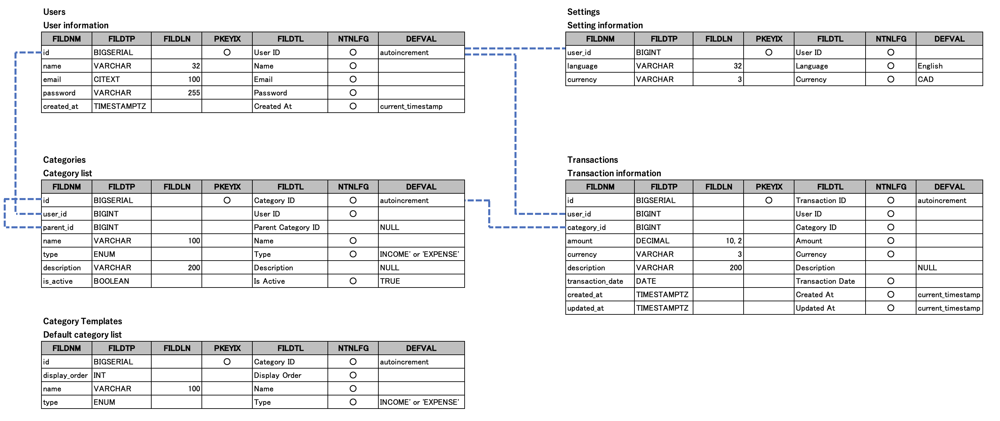

# Hac Book API

This is the backend API for a personal household accounting application.
It provides features for managing income and expenses, categories, and summary dashboards for each user.

The application is designed as a REST API, separated from the frontend (React / TypeScript / Next.js),
and includes authentication, authorization, testing, and deployment.

Frontend is here: [Hac Book Web](https://github.com/katsu0511/hac_book_web)

## Tech Stack

### Backend

- Java 17
- Spring Boot
- Spring Security
- JPA / Hibernate
- JWT authentication

### Database

- PostgreSQL

### Testing

- JUnit 5
- Mockito

### Infrastructure

- AWS EC2
- Vercel (Frontend)
- Gradle

## System Configuration

- Frontend: Next.js (Vercel)
- Backend: Spring Boot (AWS EC2)
- Database: PostgreSQL
- Authentication: JWT + HttpOnly Cookie

```
+----------------+       +----------------+       +----------------------+       +----------------+
|    Browser     | ----> |    Next.js     | ----> |   Spring Boot API    | ----> |   PostgreSQL   |
|                | <---- |    (Vercel)    | <---- |       (Vercel)       | <---- |                |
+----------------+       +----------------+       +----------------------+       +----------------+
```

## Main Functions

- User registration / login / logout (JWT authentication)
- Category Management
  - Income / Expense categories
  - Parent-Child category support
- Transaction (Income / Expense) management
  - Retrieve transactions for a specified period
- Dashboard
  - Total Income / Expense
  - Expense breakdown for each category

## Database Configuration

### Database ER Diagram

The ER diagram below shows the main database schema of this application,
including user-specific data separation and category relationships.



Main tables:

- users
- settings
- categories
- transactions

The database design considers data separation for each user,
allowing the coexistence of default categories and user-created categories.

## API Configuration

All endpoints require authentication unless otherwise specified.

| Method | Path | Description |
|--------|------|-------------|
| GET | /check-auth | Check authentication |
| POST | /login | Login |
| POST | /logout | Logout |
| POST | /signup | Register |
| GET | /categories | List categories |
| GET | /parent-categories | List parent categories |
| GET | /categories/{id} | Get category |
| POST | /categories | Create category |
| POST | /categories/{id} | Update category |
| GET | /transactions | List transactions |
| GET | /transactions/{id} | Get transaction |
| POST | /transactions | Create transaction |
| POST | /transactions/{id} | Update transaction |
| DELETE | /transactions/{id} | Delete transaction |
| GET | /dashboard/summary | Get summary |

## Authentication and Authorization

- Token-based authentication using JWT
- Tokens are stored in HttpOnly cookies
- User ownership is checked in the Service layer to prevent access to other users' data

## Testing

- Implemented unit testing mainly in Service layer
- Use JUnit 5 + Mockito for unit testing
- Repositories and external dependencies are mocked to focus on business logic
- Test coverage is over 80%

## Deployment

- Frontend: Vercel
- Backend: AWS EC2
- CI/CD is not yet introduced (planned for future improvement)

## Future Improvement

- Add integration testing of Controller layer
- Automatic testing by CI (GitHub Actions)
- Document API by OpenAPI (Swagger)
- Expand authorization management (e.g. administrator role)
