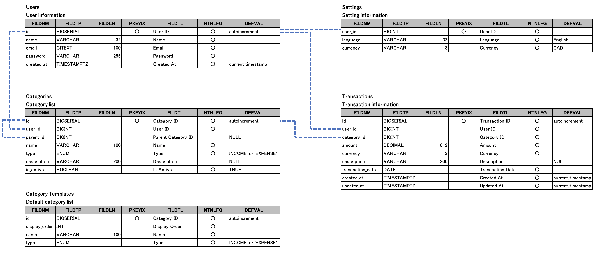

# Hac Book API

This is the backend API for a personal household accounting application.
It provides features for managing incomes and expenses, categories, and summary dashboards for each user.

The application is designed as a REST API, separated from the frontend (React / TypeScript / Next.js),
and includes authentication, authorization, testing, and deployment.

Frontend repository 👉 [Hac Book Web](https://github.com/katsu0511/hac_book_web)

## Tech Stack

### Backend

- Java 17
- Spring Boot
- Spring Security
- JPA / Hibernate
- JWT authentication

### Database

- PostgreSQL

### Testing

- JUnit 5
- Mockito

### Infrastructure

- AWS EC2
- Docker
- GitHub Actions (CI/CD)
- Gradle

## System Configuration

- Frontend: Next.js (Vercel)
- Backend: Spring Boot (AWS EC2)
- Database: PostgreSQL
- Authentication: JWT + HttpOnly Cookie

```
+----------------+       +----------------+       +----------------------+       +----------------+
|    Browser     | ----> |    Next.js     | ----> |   Spring Boot API    | ----> |   PostgreSQL   |
|                | <---- |    (Vercel)    | <---- |      (AWS EC2)       | <---- |                |
+----------------+       +----------------+       +----------------------+       +----------------+
```

## Main Functions

- User registration / login / logout (JWT authentication)
- Category Management
  - Parent-Child category support
  - Create and edit user's categories
- Transaction (Income / Expense) management
  - Retrieve transactions for a specified period
  - Create, edit and delete user's income and expense records
- Dashboard
  - Total Income / Expense
  - Expense breakdown for each category

## Database Configuration

### Database ER Diagram

The ER diagram below shows the database schema of this application,
including user-specific data separation and category relationships.



### Tables

- users
- settings
- categories
- transactions

The database design considers data separation for each user,
allowing the coexistence of default categories and user-created categories.

## API Configuration

All endpoints require authentication unless otherwise specified.

| Method | Path | Description |
|--------|------|-------------|
| GET | /check-auth | Check authentication |
| POST | /login | Login |
| POST | /logout | Logout |
| POST | /signup | Register |
| GET | /categories | List categories |
| GET | /parent-categories | List parent categories |
| GET | /categories/{id} | Get category |
| POST | /categories | Create category |
| POST | /categories/{id} | Update category |
| GET | /transactions | List transactions |
| GET | /transactions/{id} | Get transaction |
| POST | /transactions | Create transaction |
| POST | /transactions/{id} | Update transaction |
| DELETE | /transactions/{id} | Delete transaction |
| GET | /dashboard/summary | Get summary |

## Architecture

- Layered architecture (Controller / Service / Repository)
- DTO pattern used to separate API and domain models
- Validation handled at both API and database levels

## Authentication and Authorization

- Token-based authentication using JWT
- Tokens are stored in HttpOnly cookies
- User ownership is checked in the Service layer to prevent access to other users' data

## Testing

The application includes multiple layers of testing to ensure reliability and maintainability.

- Unit Testing
  - JUnit 5 + Mockito
  - Focused on business logic in the Service layer

- Slice Testing
  - Controller tests using @WebMvcTest
  - Repository tests using Testcontainers + PostgreSQL

- Integration Testing
  - End-to-end testing with Spring Boot context
  - Testcontainers + Docker used to run real PostgreSQL instances
  - Flyway used to apply database schema in tests

- Test Coverage
  - Over 80% coverage across core modules

## CI/CD

CI/CD pipeline is fully automated using GitHub Actions.

- Build Docker image on push
- Run automated tests (unit, slice, integration)
- Push image to container registry
- Deploy automatically to AWS EC2

This ensures consistent deployments and prevents regressions.

## Deployment

- Backend is containerized using Docker
- Deployed on AWS EC2
- CI/CD pipeline automatically builds, tests, and deploys the application

## Future Improvement

- Document API by OpenAPI (Swagger)
- Expand authorization management (e.g. administrator role)
